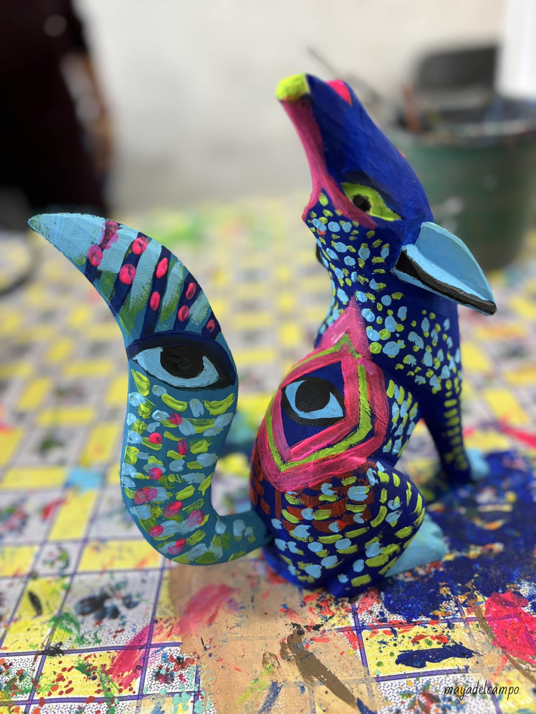

My artistic journey began with five years of training in oil painting in Paris under the mentorship of Patrice de Pracontal at Atelier de Recherche Picturale. Later, in Barcelona, I joined Studio Nomada, where I expanded into contemporary approaches, graffiti, and performance art. In Mexico, I was able to expand into clay work and ritual installations, inspired by Oaxaca, my husband’s hometown where I regularly collaborate with local artists and craftswomen.

A highlight of my practice is live painting with music, translating sound into color and gesture in real time. I have performed this at concerts and recently brought it into the hospital setting through a collaboration with the Neurosurgery Department at MD Anderson Cancer Center, as part of their Music and Medicine series. There, I invite both patients and audiences to join me in live painting, transforming music into collective visual expression.

Beyond painting, I create sculptures, fabric art, and works on found objects and canvases, always exploring materiality as a metaphor for resilience and transformation. Writing and spoken word performance are also integral to my practice, where I weave words and images into immersive storytelling.
I believe that creative expression is our universal birthright. Technique is not necessary to share one’s unique perception or contribute to collective culture; our sensibility and voice can emerge in many forms, on canvas, with natural or recycled materials, or even through the movement of our own bodies.
My artwork has been exhibited internationally, including:
• MD Anderson Cancer Center, Pain Clinic (TX, USA since 2024)
• Galerie le 18 bis (Paris, 2018)
• London Art Biennale (London, 2013)
• Art Paris (2012)
• Galerie Étienne de Causans (Solo Show, Paris, 2011)
• IparkArt (Paris, 2010)
More of my work can be seen at mayadelcampo.com.

