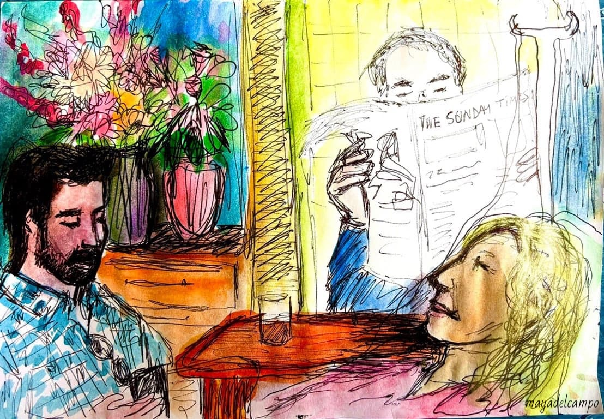

### Icanfeel: Art as Health Data

At the heart of my work is Icanfeel, a digital tool I co-developed with programmers Andrew Porter and Gwenaëlle Duchesne between 2021 and 2023. 
Icanfeel was designed to help patients express symptoms through collage, metaphor, and voice. It is currently in clinical trial at MD Anderson Cancer Center. 
By translating art based expressions into health data, the tool complements traditional assessments and opens new channels of communication when words are not enough. 
Icanfeel bridges art and science, offering patients, especially those living with cancer or in palliative care, a creative language for their experience. 
You can read the preliminary results from the trial in my published (doctoral dissertation)[https://digitalcommons.lesley.edu/expressive_therapies_dissertation/5/].

### Wecanfeel: Expanding to Families

Building on this work, we are developing Wecanfeel, a companion tool designed to support families facing oncological care. Wecanfeel focuses on the emotional dimensions of medical decision-making, offering a structured yet creative way for patients, their children, caregivers, and clinicians to communicate around difficult choices. This project reflects my commitment to ensuring that not only the patient’s voice, but also the family’s emotional reality, is included in care conversations. 

### AI & Attunement: Exploring New Frontiers

As a visiting scholar at The New School University in New York, I research the role of AI and attunement in therapy. 
This work explores whether AI generated images and tools can enhance empathy, presence, and relational depth, or whether they risk distancing us. Through collaborative studies with clinicians and artists, I examine how technology might support, rather than replace, the therapeutic relationship, while also considering issues of ethics, inclusivity, and creativity. 

### A New Dimension of Care. 

Together, these projects imagine a future where art, technology, and clinical care intertwine. Rooted in compassion and curiosity, this research asks how we can reimagine healthcare through creativity, ensuring that patients and families feel heard, seen, and supported at every stage. 
