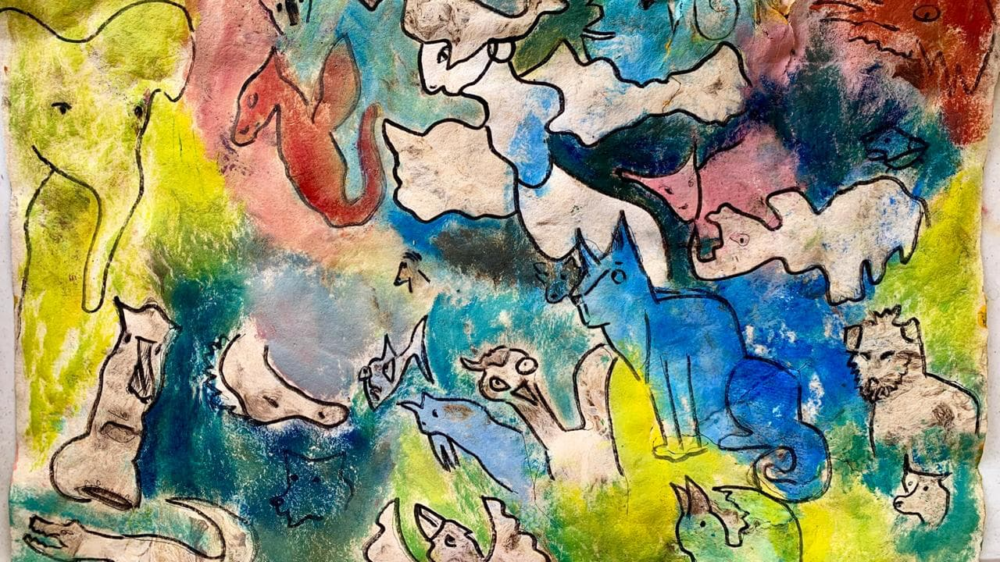
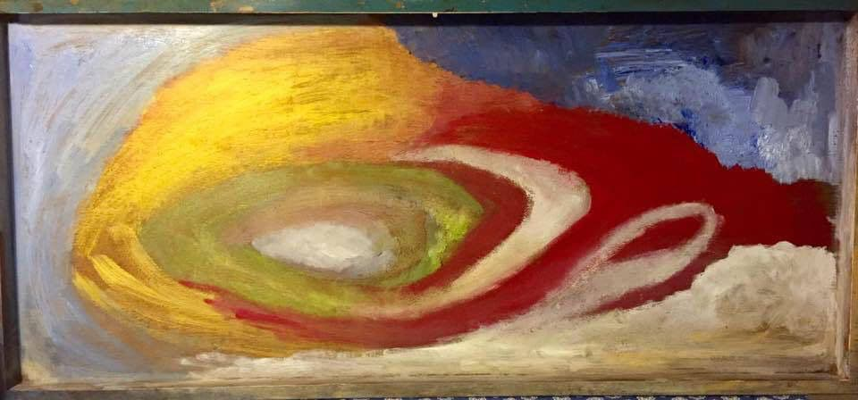

As a multicultural and trilingual speaker (French, Spanish, English), I bring creativity, clinical insight, and global perspective to conferences, workshops, and community events. I have presented on topics including grief and resilience, psycho-oncology, AI and digital health innovation, and the role of expressive arts in palliative care. 

My style is playful and reflective: I invite groups to think deeply, to question assumptions, and to explore expressive arts as a language for innovation and change. Whether in an intimate workshop or a high-level international conference, I create spaces where professionals, patients, and communities can connect meaningfully through dialogue, art, and imagination. 

I welcome opportunities to collaborate with universities, health organizations, and cultural institutions to explore how creativity can transform the way we understand care, resilience, and human dignity. 

Selected Conference Presentations & Invited Lectures
Grief, Palliative Care & Psycho-Oncology

- He(Art) and Spirit: Art Therapy in Palliative Care — Conference Presentation, 14th Annual Collective Soul Symposium, MD Anderson Cancer Center, Houston, TX (2024)
- The Art of Grieving — Invited Lecture, Psychiatry Educational Lecture Series, MD Anderson Cancer Center, Houston, TX (2024)
- Art Therapy for the Management of Distress — Grand Rounds, Palliative, Rehabilitative, and Integrative Medicine, MD Anderson Cancer Center, Houston, TX (2024)
- Grief and Dying: An Exploration with the Creative Therapies — Conference Presentation, Sommet Francophone d’Art Thérapie (Online, 2023)
- Exploration of Grief — Interactive workshop, Rothko Chapel, Houston, TX (2023)
- Art and Grief — Invited Lecture, Jung Institute, Houston, TX (2023)
- Art Therapy in Pediatric Oncology — Conference Presentation, Latin American Pediatric Oncology Conference, Guadalajara, Mexico (2024)
  Innovation, AI & Health
- Artificial Intelligence in Precision Medicine: Challenges and Opportunities — Panel Presentation, EU4Health Conference (2025)
- Using Generative AI Imagery in Art Therapy: Ethics, Identities, and Attunement in Art Therapy — Conference Presentation, New York State Psychological Association’s 2024 Annual Convention
- The Innovation Journey — Conference Presentation, American Art Therapy Association Conference, Pittsburgh, PA (2024)
- Filling the Gaps: From Memory to Narratives with AI Generative Art— Conference Presentation, American Art Therapy Association Conference, Pittsburgh, PA (2024)
- A Digital Art Tool to Enhance the Detection of Distress — Conference Presentation, American Art Therapy Association Conference, San Diego, CA (2023)
- Artful Connections: Technology, Art Therapy, and Mental Health — Panel Presentation, American Art Therapy Association Conference (Online, 2023)
- Innovation in Art Therapy — Guest Lecture, Universidad Iberoamericana, Mexico City, Mexico (2023)
- Visiting Scholar Lecture Series – AI, Art & Healthcare — The New School University, New York (2023–2024)
